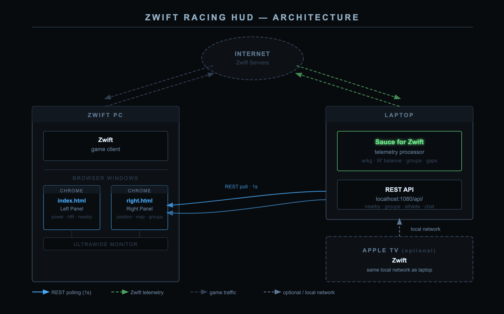

# zwift-racing-hud

A browser-based racing overlay for Zwift, designed for ultrawide monitors. Two standalone HTML panels sit side-by-side and pull live data from [Sauce for Zwift](https://www.sauce.llc/) via its local REST API.

---

## Panels

### `index.html` — Left Panel
- Live power, W' balance gauge and bar
- Heart rate, cadence, speed, draft
- Trip stats: distance, elapsed time, distance/time remaining
- Power peaks: 5s, 15s, 1m, 5m, 20m
- Rolling 5-minute chart: power, HR, cadence
- Nearby riders table with gap, w/kg, W' balance

### `right.html` — Right Panel
- Race position, gap to rider ahead, gap to rider behind
- Mini-map with three rendering modes (see below)
- Groups visualization: gap between groups, avg w/kg, size, your position within your group
- In-game chat feed (if exposed by Sauce API)

---

## Architecture

Both panels are single self-contained HTML files with no build step, no framework, and no external dependencies beyond Google Fonts. All logic is vanilla JavaScript.

```
zwift-racing-hud/
├── index.html     # Left panel
├── right.html     # Right panel
└── README.md
```


### Data flow

```
Sauce for Zwift (localhost:1080)
        │
        │  REST polling, 1s interval
        ▼
  Browser (Chrome)
  ├── index.html  →  nearby/v2, athlete/v2/watching
  └── right.html  →  nearby/v2, groups/v2, chat (probed)
```

- **No WebSocket.** Both panels use `setInterval` + `fetch` at 1-second intervals.
- **No shared state** between panels. Each polls independently.
- **Athlete cache.** Names and weights are fetched once per athlete via `athlete/v1/:id` and cached in memory for the session.

### API endpoints used

| Endpoint | Panel | Purpose |
|---|---|---|
| `nearby/v2` | Both | Rider positions, gaps, power, W' balance |
| `athlete/v2/watching` | Left | Self telemetry: power, HR, cadence, speed, peaks |
| `groups/v2` | Right | Race group detection |
| `athlete/v1/:id` | Both | Athlete name and weight (cached) |
| `chat/v1` (probed) | Right | In-game chat feed |
| `worlds/v1` et al (probed) | Right | Route shape for mini-map |

### Mini-map rendering

`right.html` probes for route geometry on connect and falls back gracefully:

1. **Route map** — if a route shape endpoint returns a point array, draws the course as a polyline and plots rider dots on it. Supports `{x,y}`, `{lat,lng}`, and `[lng,lat]` coordinate formats. Riders with a `roadPosition` field (0–1 fraction) are interpolated onto the route.
2. **Scatter** — if no route shape is found but riders have `x`/`y` world coordinates, renders a dot-plot.
3. **Gap chart** — horizontal linear fallback. Left = ahead (red), right = behind (green). Your position is centered. Riders within 20 seconds get their gap labelled.

The active mode is shown in the bottom-right corner of the map panel.

---

## Requirements

- [Sauce for Zwift](https://www.sauce.llc/) installed and running
- Chrome (recommended) or any modern browser
- Zwift running on the same machine, or Sauce accessible on the local network

---

## Setup

### Quickstart (no server needed)

1. Start Zwift and make sure Sauce for Zwift is running
2. Open `index.html` in Chrome — drag to the left half of your monitor
3. Open `right.html` in Chrome — drag to the right half
4. Both panels default to `localhost:1080` and connect automatically

That's it. No install, no server, no build step.

### If Sauce is running on a different machine

Edit the host field in the connection bar at the top of either panel, or change the default value in the HTML:

```html
<input id="sauce-host" ... value="192.168.86.X:1080" ...>
```

### Dev iteration

```bash
npx live-server --port=3000              # left panel with auto-reload
npx live-server --port=3001 --entry-file=right.html  # right panel
```

---

## Design system

Both panels share an identical set of CSS variables and typography. Do not override these in one panel without updating the other.

| Token | Value | Usage |
|---|---|---|
| `--bg` | `#080b0f` | Page background |
| `--bg2` | `#0d1117` | Section headers, footer |
| `--bg3` | `#111820` | Input fields, inner fills |
| `--border` | `#2a3f54` | Borders, gaps between cells |
| `--accent` | `#00aaff` | Self highlight, active states |
| `--green` | `#00e87a` | Positive / behind / healthy |
| `--red` | `#ff2d55` | Negative / ahead / danger |
| `--yellow` | `#f5c400` | Warnings, power-ups, selected |

Fonts: **Roboto Mono** (numbers and code values) + **Barlow Condensed** (labels and badges), both loaded from Google Fonts. System font fallbacks are defined for offline use.

---

## Distribution

To share with others:

1. Zip `index.html`, `right.html`, and this `README.md`
2. Recipients open both files directly in Chrome — no server required
3. Sauce for Zwift defaults to `localhost:1080` so no configuration is needed for most users

---

## Known limitations / future work

- Groups `v2` endpoint shape is version-dependent — field mapping may need adjustment based on your Sauce version
- Chat endpoint is probed but not confirmed available on all Sauce builds
- Route geometry endpoints are probed opportunistically — map falls back to gap chart if none respond
- No persistent settings — host preference resets on page reload